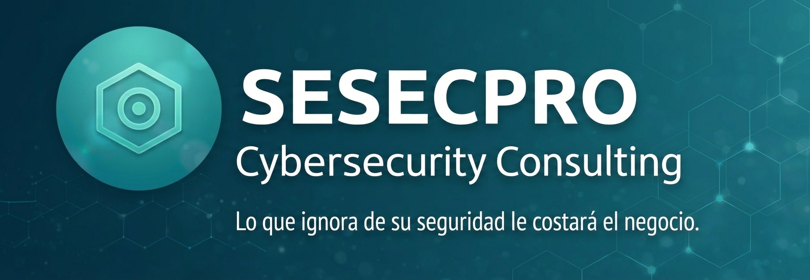

  

# Sesecpro | Enterprise Cybersecurity Services 🛡️

**Liderazgo ejecutivo y resiliencia estratégica para organizaciones globales.**

Firma de consultoría estratégica y servicios gestionados de seguridad (MSSP) con sede en Valencia. Proporcionamos liderazgo ejecutivo (**vCISO**), arquitectura **Cloud Native** y gobernanza avanzada para asegurar la libertad operativa de su negocio.

---

### 🚀 Capacidades Enterprise

* **vCISO as a Service:** Liderazgo estratégico y comunicación directa con el Consejo de Administración.
* **Gobernanza & Cumplimiento (GRC):** Implementación de marcos operativos **NIS2**, **DORA** e **ISO 27001**.
* **Cloud & Edge Security:** Arquitectura **Zero Trust**, Hardening de Microsoft 365 y seguridad en el extremo (SASE).
* **IA & Respuesta:** Inteligencia de amenazas predictiva y automatización de incidentes (SOAR).

### 🏛️ Estándares y Metodología
Operamos bajo los marcos internacionales de referencia más rigurosos:
`NIST CSF 2.0` `ISO/IEC 27001:2022` `OWASP ASVS` `MITRE ATT&CK`

---

### 📂 Ecosistema de Activos Estratégicos
Acceso directo a nuestras herramientas, guías de auditoría y marcos de trabajo públicos:

* 📢 [**Security Advisories**](./security-advisories) - Inteligencia de amenazas y alertas críticas Enterprise.
* 🏛️ [**Business Risk Framework**](./Business-Risk-Framework) - Gestión de riesgos y gobierno corporativo.
* 📋 [**Compliance Checklists**](./compliance-checklists) - Auditorías rápidas para NIS2, DORA e Higiene Digital.
* 🏗️ [**Zero Trust Blueprints**](./zero-trust-blueprints) - Estándares de arquitectura y hardening cloud.
* 🛠️ [**Legal Identity Audit Toolkit**](./legal-identity-audit-toolkit) - Verificación técnica de identidad digital.

---

### 🌐 [sesecpro.es](https://sesecpro.es) | 📩 [contacto@sesecpro.es](mailto:contacto@sesecpro.es)

> *La ciberseguridad no es un coste de IT, es la base de la libertad operativa y financiera de su negocio.*

© 2026 SESECPRO. Todos los derechos reservados.
